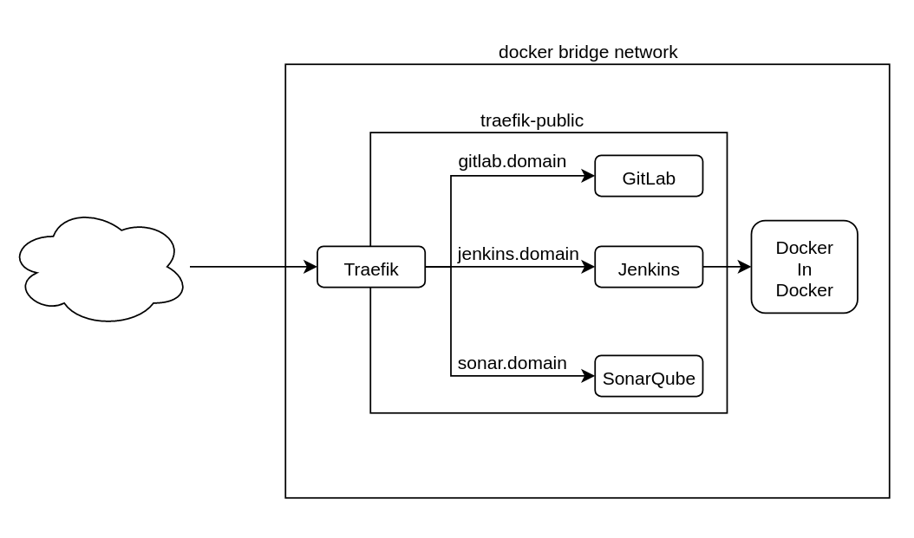

# Example CI/CD pipeline with Jenkins, SonarQube and GitLab

Example jenkins CI/CD pipeline with Jenkins, SonarQube and GitLab.
There are 2 projects, one in maven and other on node in TypeScript

## Swarm Stack

The swarm docker cluster consists of 5 services:

1. Traefik
2. GitLab
3. SonarQube
4. Jenkins
5. Docker in Docker

The first one, `traefik`, is a reverse proxy that acts as a loadbalander
and dns. `gitlab` and `sonarqube` are self explanatory,
and the `Jenkins` is my own image, that
contains extra packages, python modules and jenkins plugins which can be
found on my [Docker Hub Repo](https://hub.docker.com/r/lucastercas/jenkins) or
on my [GitHub Repo](https://github.com/lucastercas/docker-images).

The `jenkins` one points its `DOCKER_HOST` environment variable to
the `docker-in-docker` service, to use it as the engine to run docker images.
This last service, the `docker-in-docker` container, is an image that
allows you to run a docker container inside another docker container. It
is used to run the docker agents of jenkin, so each time a jenkins agent
is run, there are 3 containers: the jenkins one, the docker-in-docker
one, and inside it the jenkins agent one.

If you don't want to, or don't have a DNS, you can still use
the service using `docker-compose` and the compose file provided,
however, this isn't recommended on production. The services will
be available on its ports on `localhost`. GitLab uses port `2000:80`,
Jenkins uses ports `3000:5000` and `3001:8080` and SonarQube
uses port `4000:9000`.



## Apps

As said, this repo also contains 2 apps to test the pipeline, a `Java`
one, with `Maven`, `Spring Boot` and `Jacoco` and a `TypeScript` one, with
`Node.js`, `Koa` and `Jest`.

## Configuration of Services

### Jenkins

When you first start the jenkins container, it will ask for a initial token,
which can be :

### GitLab

### SonarQube

## Instalação Inicial

### Subindo os Containers

### Configurando os Serviços

### Jenkins

1. Configurar Jenkins
   Para o jenkins, a primeira vez vai pedir uma chave, tem o comando
   `make get_key` no Makefile desse repositório, que vai exibir essa chave.
   Após inserir a chave, clicar em _Install suggested plugins_, e depois
   criar um usuário e seguir as telas.

### GitLab

1. Configurar GitLab
   Criar a senha pro usuário `root`.

1. Criar Projeto no GitLab
   Na interface do GitLab, clicar em _Create a Project_, botar o nome do
   projeto, e clicar em _Create project_.

Para adicionar o código da aplicação para o repositório:

```bash
$ cd app
$ git init
$ git remote add origin http://localhost:5000/root/<project-name>.git
$ git add .
$ git commit -m "First Commit"
$ git push origin master
```

### SonarQube

1. Configurar SonarQube
   Acessar o site, e logar como _admin_, senha _admin_.

2. Criar um novo projeto
   Ao entrar, clicar em _Create new project_, a project key é
   _org.springframework:gs-spring-boot-docker_, e o display name
   pode ser qualquer um. Ao completar esse passo, o SonarQube
   vai pedir para criar um nome para o token, para ele gerar.

3. Configurar o token
   Copiar o token gerado pelo SonarQube, editar o arquivo
   `.env`, e criar a variavel `SONAR_TOKEN`, com o valor
   dela sendo o token gerado.

### GitLab e Jenkins

1. Adicionar Pipeline no Jenkins
   Na interface do Jenkins, clicar em _Novo job_ -> _Pipeline_, digitar um nome
   para a pipeline, e clicar em _Criar_

Nas abas em cima, ir para _Pipeline_ -> _Definition_, e selecionar
_Pipeline script from SCM_. Em SMC, selecionar Git, adicionar a
url do repositório (`http://gitlab/root/<project-name>`), e adicionar
as credenciais, inserindo o username e password do usuário
do GitLab.

3. Rodar Pipeline

### SonarQube e Jenkins

1. Configurar o SonarQube no Jenkins

2. Configurar o WebHook do SonarQube

## Referências

1. [Java App with Maven](https://www.jenkins.io/doc/tutorials/build-a-java-app-with-maven/)
2.
